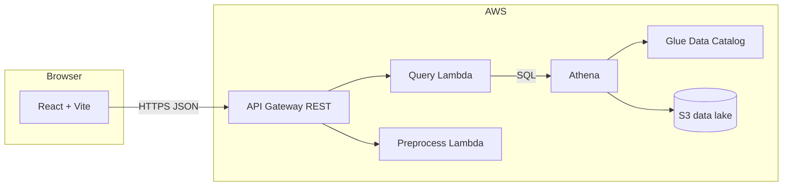

# Architecture

This project is a small full-stack demo for exploring CalCOFI-style oceanographic metrics: a React frontend talks to AWS API Gateway, which invokes Python Lambda functions. Query traffic is designed to run SQL against Amazon Athena over data in S3, with AWS Glue providing the table catalog.

## High-level diagram

## Components

| Layer | Location | Role |
| --- | --- | --- |
| Frontend | `frontend/` | Single-page app; calls the API with `VITE_API_URL`. |
| API | `infrastructure/template.yaml` | SAM-defined API Gateway stage `Prod` and Lambda integrations. |
| Query service | `backend/hello_world/app.py` | `POST /query` runs SQL via **boto3** + Athena (`query_builder.py`). Requires `ATHENA_OUTPUT_LOCATION` from stack parameter `AthenaOutputLocation`. |
| Preprocess service | `backend/functions/preprocessData/` | Placeholder endpoint for batch or ETL triggers. |
| Data definitions | `data/schemas/`, `data/queries/`, `data/sample_data/` | Glue/Athena DDL, ad hoc SQL for debugging, sample CSV for demos. |

## Request flow (query path)

1. The browser sends `POST {ApiEndpoint}/query` with a JSON body (optional `metric`, `depth`).
2. API Gateway forwards the request to the query Lambda (`app.lambda_handler`).
3. The Lambda returns placeholder JSON. Later, this step will build SQL for `calcofi_db.bottle_data`, run Athena, and return query results.

## Deployment shape

- **Backend:** `sam build` / `sam deploy` using `infrastructure/template.yaml` (see `scripts/deploy_backend.sh`).
- **Frontend:** static files built with Vite and synced to an S3 bucket (see `scripts/deploy_frontend.sh`); optionally fronted by CloudFront.
- **Data:** sample CSV uploaded to S3 with `scripts/seed_data.sh`; the Athena external table `LOCATION` must match that prefix.

## Security and operations (hackathon defaults)

- CORS is open (`*`) on the API for quick demos; tighten origins for production.
- The query Lambda has IAM permissions for Athena, S3 (including result writes), and Glue reads; scope resources down for production.
